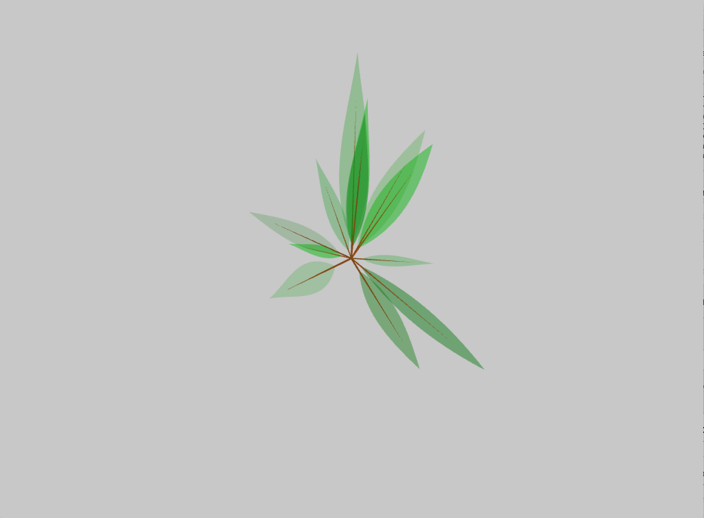
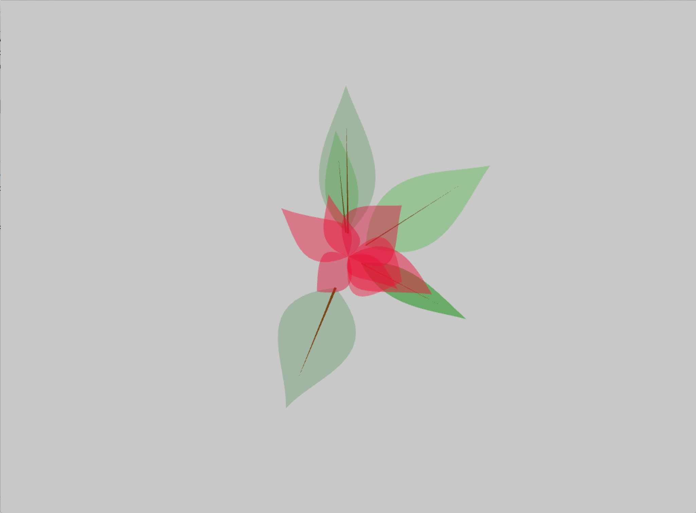

# Week 2 Leaves Assignment

stephLeaves2 and stephLeavesFlowers are very similar.  I've played around with the leaf size and opacity for different effects.  

Please note that these files were rebuilt using the new openFrameworks and XCode 7, so some of the syntax has been changed from our class structure after the fact.  For instance, I am using hpp files rather than h files for the created header files outside of main.

Example of stephLeaves: 

Example of stephLeavesFlowers:

