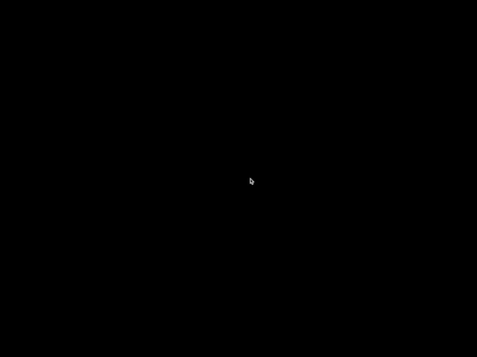

# Week 6 Fireworks Assignment

This code uses a bit of code from the fboExample in openFrameworks. I also took code from the blog How To: Create a Simple Fireworks Effect in OpenGL and SDL, although a lot of that has been changed in my example.

As you can see, I could never quite clear the fbo all the way to get rid of the trails.  But I ran out of time to experiment with it further.

Example of tree animation cycling through all the seasons: 
  

